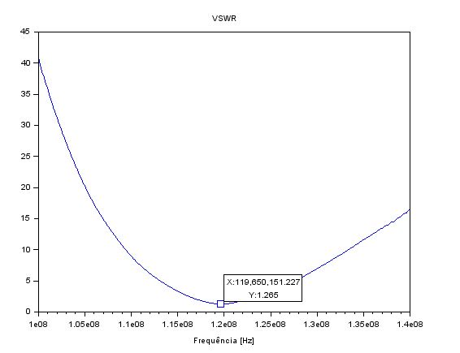
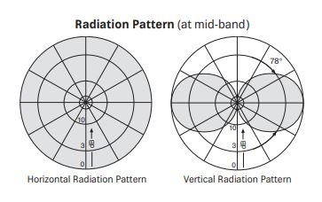

# Antena
## ANTENA ICOM FAB01AR (IMBEL)

- Impedância de entrada 50Ohms

- Range de frequências: 108 - 137 MHz

- Diagrama de radiação e Ganho: como a antena é omnidirecional e simétrica, os valores medidos no plano horizontal são iguais (formam um círculo).
Para encontrar o diagrama de radiação da antena no plano vertical, é necessário variar seu ângulo em relação ao transmissor de 0°(paalela apontada para cima) a 180° (paralela apontada para baixo) e depois espelhar esses valores para o intervalo de 180° a 360°.
Tais valores encontrados são os ganhos relativos. Para determinar o ganho real para cada ângulo de inclinação, é feito um somatório (S) 
de todos os ganhos relativos, e para cada ângulo, seu ganho relativo é dividido por S. 

- Diretividade: Omnidirecional

- Polarização: Vertical

- VSWR: Mínimo de 1,265 em 119,65 MHz

## Outras antenas que atendem às especificações do projeto

## ANTENA Kathrein K512631 
(https://www.kathrein-bca.com/files/9980000098_ground-to-air_k-gmbh.pdf)

- Impedância de entrada 50Ohms
- Range de Frequências: 118 – 144 MHz
- Ganho: 0 dBd = 2,15 dBi
- Diretividade: Omnidirecional
- Polraização: Vertical
- VSWR: < 1,6 (118 – 144 MHz)
- Diagrama de polarização:

## ANTENA Nagoya NA-771A 
(https://www.passion-radio.com/vhf-air-band/na-771a-560.html)

- Impedância de entrada 50Ohms
- Range de Frequências: 118 – 136 MHz
- Ganho: 2 dBi
- Diretividade: Omnidirecional
- Polraização: Vertical
- VSWR: < 1,5

