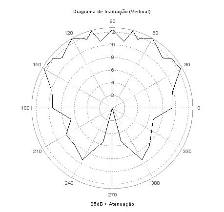

# Antena

## Definição e Propósito

Antena é um dispositivo que irradia ou recebe ondas de rádio, no caso do projeto do receptor a função desta é receber um sinal de rádio AM. Para o projeto de uma antena são importantes os seguintes parâmetros:

- Impedância de entrada
- VSWR
- Diagrama de radiação (obtido de forma não ideal)

- Diretividade
- Largura de feixe
- Ganho
- Polarização

  
A antena vista como um elemento de circuito é um sistema ressonante, por isso é necessário que a impedância de entrada esteja adaptada a isso. Ela é então utilizada como um transformador de impedância entre a linha de transmissão e o espaço livre.

  
O VSWR (Voltage Standing Wave Ratio) é um parâmetro que redimensiona o parâmetro s11 da antena, que é o coeficiente de reflexão de tensão, ou seja, representa a potência que não foi transmitida (que refletiu e voltou).

  
O diagrama de radiação mostra as direções nas quais a antena irradia/recebe ondas eletromagnéticas com mais eficiência, deve ser obtido em um meio sem interferência física de outros objetos.

  
Diretividade é a relação entre a densidade de potência criada em uma dada direção e a densidade de potência de uma antena isotrópica, determina a capacidade de uma antena de concentrar a energia irradiada em uma direção. No caso do projeto, ela é omnidirecional.

  
O ganho possui a mesma definição da diretividade, mas leva em conta a potência fornecida pela antena.
 
  
A polarização se refere à orientação dos campos elétrico e magnético em relação à Terra. A polarização linear vertical (campo elétrico vertical em relação à Terra) é a preferível nas faixas de VHF onde as antenas são mais curtas.
 
  
É importante em um projeto que seja feito o balanço de enlace, cálculo da potência em vários pontos do enlace de forma a garantir qualidade da recepção do sinal, ou seja, é uma medida de desempenho do sistema de comunicações. Sâo levados em consideração no cálculo: potência recebida, potência transmitida, ganho da antena de recepção, ganho da antena de transmissão, perdas.
   

## Antenas que atendem às especificações do projeto

## ANTENA ICOM FAB01AR (IMBEL)

- Impedância de entrada 50Ohms

- Range de frequências: 108 - 137 MHz

- Diagrama de radiação e Ganho: como a antena é omnidirecional e simétrica, os valores medidos no plano horizontal são iguais (formam um círculo).
Para encontrar o diagrama de radiação da antena no plano vertical, é necessário variar seu ângulo em relação ao transmissor de 0°(paalela apontada para cima) a 180° (paralela apontada para baixo) e depois espelhar esses valores para o intervalo de 180° a 360°.
Tais valores encontrados são os ganhos relativos. Para determinar o ganho real para cada ângulo de inclinação, é feito um somatório (S) 
de todos os ganhos relativos, e para cada ângulo, seu ganho relativo é dividido por S. 

- Diretividade: Omnidirecional

- Polarização: Vertical

- VSWR: Mínimo de 1,265 em 119,65 MHz

## ANTENA Kathrein K512631 
(https://www.kathrein-bca.com/files/9980000098_ground-to-air_k-gmbh.pdf)

- Impedância de entrada 50Ohms
- Range de Frequências: 116 – 152 MHz
- Ganho: 0 dBd = 2,15 dBi
- Diretividade: Omnidirecional
- Polraização: Vertical
- VSWR: < 1,6 (118 – 144 MHz)
- Diagrama de polarização:

## ANTENA Nagoya NA-771A 
(https://www.passion-radio.com/vhf-air-band/na-771a-560.html)

- Impedância de entrada 50Ohms
- Range de Frequências: 118 – 136 MHz
- Ganho: 2 dBi
- Diretividade: Omnidirecional
- Polraização: Vertical
- VSWR: < 1,5

## Antena escolhida para o projeto

  
Foi escolhida inicialmente a antena Kathrein K512631, por falta de informações em relação à antena disponibilizada para uso real. Após análise completa da antena ICOM FAB01AR (disponibilizada pela IMBEL) esta será escolhida para uso ou descartada em definitivo.

